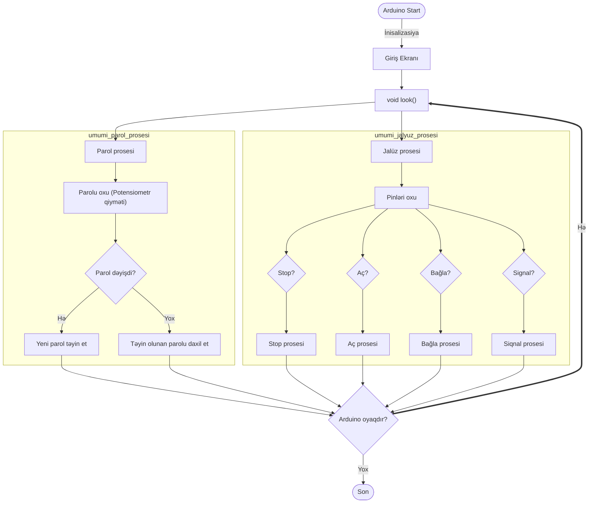

# JalDar (EN6.1) - yeni versiya

## Məlumat
Bu layihə [Elxan Əliyev](https://github.com/elkhan-aliyev) tərəfindən tərtib edilmiş və şəxsi istifadə üçün nəzərdə tutulmuşdur. Proqramın tərtib edilməsində [Nurlan Əliyev](https://github.com/nurlan-aliyev) də iştirak etmişdir. 

## Problem
Bu layihənin ərsəyə gəlməsinin əsasında, illərlə əllə idarə olunan qaraj jalüzünün yaratdığı narahatlıq durur. Yaxın illər ərzində avtomatlaşdırma tədbirləri görülmüş, lakin, müxtəlif hallarda uğursuzluqlar meydana gəlmişdir. Həmin bu layihənin əsas məqsədi, geridə qalan boşluqları doldurub, prosesi tamamilə avtomatlaşdırmaqdır. 

## İstifadə olunan ləvazimatlar 

### Hardware 
- Atmega328P
- LCD1602 (I2C)
- Şəxsən yaradılmış lövhələr və cihazlar (Elxan Əliyev, 2016-2025 ərzində, Lerik, Azərbaycan)

### Software
- [ArduinoIDE](https://www.arduino.cc/en/software)
- [Wokwi Simulator](https://wokwi.com/projects/421055215095632897)

## Flowchart
 

